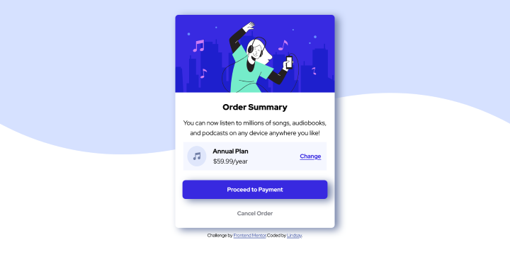

# Frontend Mentor - Order summary card

# Frontend Mentor - Order summary card solution

This is a solution to the [Order summary card challenge on Frontend Mentor](https://www.frontendmentor.io/challenges/order-summary-component-QlPmajDUj/hub/order-summary-using-html-and-css-only-9oKNa6CYd). Frontend Mentor challenges help you improve your coding skills by building realistic projects.

## Table of contents

- [Overview](#overview)
  - [The challenge](#the-challenge)
  - [Screenshot](#screenshot)
  - [Links](#links)
- [My process](#my-process)
  - [Built with](#built-with)
  - [What I learned](#what-i-learned)
  - [Continued development](#continued-development)
  - [Useful resources](#useful-resources)
- [Author](#author)
- [Acknowledgments](#acknowledgments)

## Overview

This is an order summary compenent that can be used for any e-commerce site.

### The challenge

Users should be able to:

- See hover states for interactive elements

### Screenshot

### Links

- Solution URL: [https://www.frontendmentor.io/solutions/order-summary-using-html-and-css-only-9oKNa6CYd](https://www.frontendmentor.io/solutions/order-summary-using-html-and-css-only-9oKNa6CYd)
- Live Site URL: [https://lindsayreiner.github.io/order-summary-component/](https://lindsayreiner.github.io/order-summary-component/)

## My process

The challenge for myself was to not use any CSS frameworks to design this page so all styling was done with pure CSS.

### Built with

- Semantic HTML5 markup
- CSS custom properties
- Flexbox
- Mobile-first workflow

### What I learned

I had some challenges with alignment of the different components that made up the card, and its overall positioning on the page. Solidified knowledge on these topics.

## Author

- Website - [Lindsay Reiner](https://lindsayreiner.github.io/lindsay_porfolio2.0/)
- Frontend Mentor - [@lindsayreiner](https://www.frontendmentor.io/profile/lindsayreiner)

